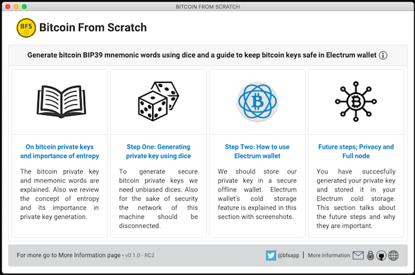
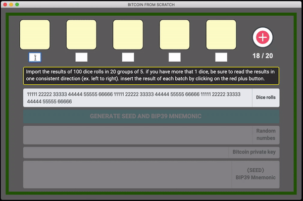
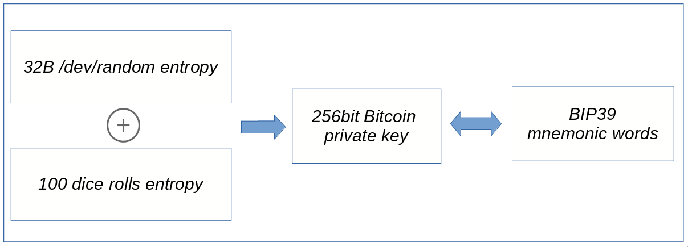
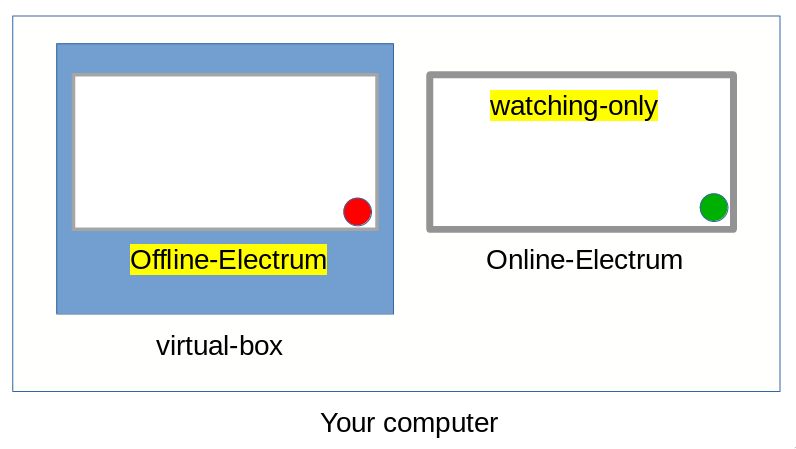

## Bitcoin From Scratch

### Guides and tutorials on:
* Bitcoin private key and BIP39 mnemonic words
* The importance of entropy in generating private keys
* Generating Bitcoin private key and mnemonic using dice
* Using Electrum wallet in Cold storage and Watching only mode
* Future steps; Privacy and Full node

### Generate bitcoin BIP39 mnemonic words using dice

### Overview of generating the bitcoin seed and mnemonic words

### How to use 2 instances of Electrum wallet for Cold storage + Watching only

### Works on Windows, Mac and linux

<pre>
git clone https://github.com/bitcoinfromscratch/bfs-dice.git
npm install
npm start
</pre>